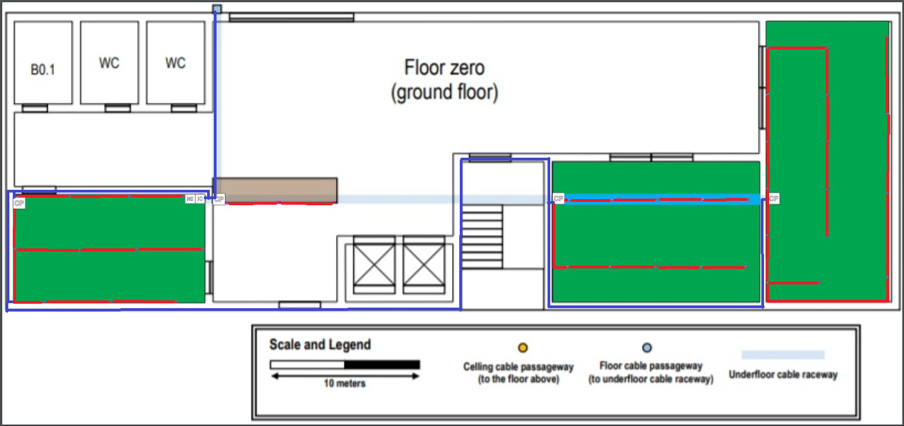
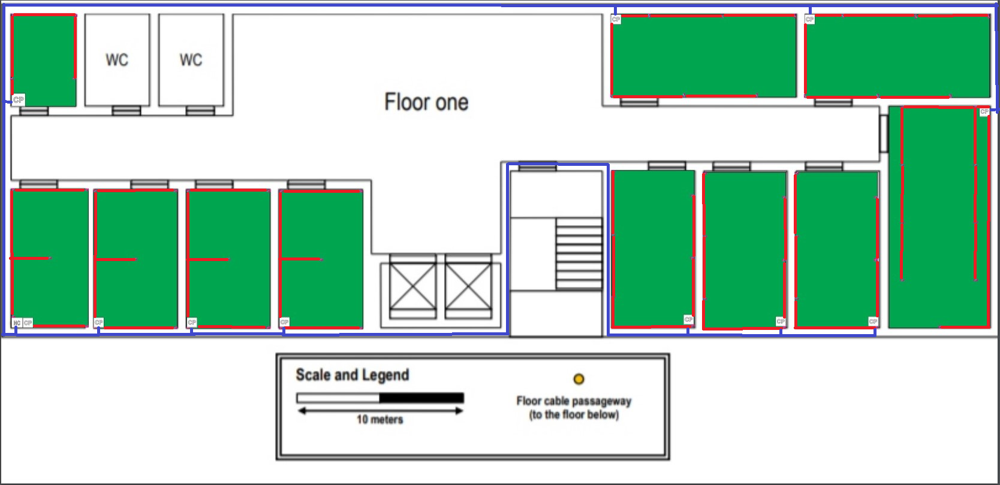

RCOMP 2019-2020 Project - Sprint 1 - Member 1180730 folder
===========================================

=========================================== Building B      
===========================================
 - **Dimensions:** Building B horizontal dimensions are, approximately, 60 x 20 meters (1200m²).

## Ground Floor: ##

  * [piso 0.pdf](piso 0.pdf)
  * [piso 0 com wifis.pdf](piso 0 com wifis.pdf)

##### Area of each room and respective number of outlets: ####

  - B0.1. - Storage Room
  - B0.2. - 12,60*7,07=89,08 m² - 20 outlets
  - B0.3. - 12,7*9,1=115,57 m² - 28 outlets
  - B0.4. - 18,45*8,28=151.11 m² - 34 outlets
  - Brown Table - 8,27*1,72=14,22 m² - 6 outlets

##### Total number of outlets, HC, CP: #####

  - Total outlets: 88
  - Total CP: 4 one for each room/table (3 switches of 24 cables and 1 of 48 cables and 3 Patch Panels of 24 cables and 1 of 48 cables)
  - Total HC: 1
  - Total Wireless 802.11 Routers: 2

##### Cable Pathways and Measures: #####

 Legend: Blue represents Fiber and Red represents Copper

From outside of the building to the IC - 14 meters (Fiber)
From the IC to the HC - 1 meter (Fiber)

- Brown Table
    * From the HC to the CP - 3 meters (Fiber)
    * From the CP to the different outlets the total of Copper is 30
    * 1,5 * 2+5 * 2+8,27 * 2=29,54

- B0.2.
    * From the HC to the CP - 13 meters (Fiber)
    * From the CP to the differents outlets the total of Copper is 190,2 meters
    * 12 * 2+8 * 2+4,4 * 2+0,2 * 2+3,54+9,30 * 2+13,45 * 2+18 * 2+16,20+11,8 * 2+8 * 2=190,04 m
    * [B0.2.pdf](b0.2.pdf)

- B0.3.
    * From the HC to the CP - 25 meters (Fiber)
    * From the Cp to the differents outlets the total of Copper is 245 meters
    *  1 * 3+3,6 * 3+6,4 * 2+9,2 * 3+12 * 3+5,3 * 3+8,1 * 3+10,9 * 2+13,7 * 3+16,5 * 3=242,8
    * [B0.3.pdf](B0.3.pdf)

- B0.4.
    * From the HC to the CP - 40 meters (Fiber)
    * From the CP to the different outlets the total of Copper is 560 meters
    * 1 * 2+4,3 * 2+7,5 * 2+10,625 * 2+14,8 * 2+34,18 * 2+18,125 * 2+28,76 * 2+21,455 * 2+24,785 * 2+23,34 * 4+3,75 * 2+28,115 * 2+17,5 * 2+7,08 * 2+10,83 * 2=558,97
    * [B0.4.pdf](B0.4.pdf)

## First Floor: ##

  * [piso 1.pdf](piso 1.pdf)
  * [piso 1 com wifis.pdf](piso 1 com wifis.pdf)

##### Area of each room and respective number of outlets: ####

  - B1.1. - 5,05*3,8=19,19 m² - 6 outlets
  - B1.2. - 8,32*4,43=36,86 m² - 10 outlets
  - B1.3. - 8,32*6=49,92 m² - 12 outlets
  - B1.4. - 8,32*6=49,92 m² - 12 outlets
  - B1.5. - 8,32*6=49,92 m² - 12 outlets
  - B1.6. - 9,45*4,97=46,97 m² - 12 outlets
  - B1.7. - 9,45*4,97=46,97 m² - 12 outlets
  - B1.8. - 9,45*4,97=46,97 m² - 12 outlets
  - B1.9. - 13,30*6=79,8 m² - 18 outlets
  - B1.10 - 11,16*5=55,8 m² - 14 outlets
  - B1.11 - 11,16*5=55,8 m² - 14 outlets

##### Total number of outlets, HC, CP: #####

  - Total outlets: 134
  - Total CP: 11 one for each room (11 switches of 24 cables and 11 Patch Panels of 24 cables)
  - Total HC: 1
  - Total Wireless 802.11 Routers: 2

  Check First_Floor_Outlets.pdf for the display of the outlets, HC and CP.

##### Cable Pathways and Measures: #####

 Legend: Blue represents Fiber and Red represents Copper

  From the ground floor IC to the first floor HC - 24,5 m (Fiber)

- B1.1.
    * From the HC to the CP - 38 meters (Fiber)
    * From the CP to the different outlets the total of Copper is 43 meters
    * 1,8 * 2+5,1+8,9+12,5 * 2=42,6
    * [B1.1.pdf](B1.1.pdf)

- B1.2
    * From the HC to the CP - 1 meter (Fiber)
    * From the CP to the different outlets the total of Copper is 66,5 meters
    * 1 * 2+8,35 * 2+12,8 * 2+4,5 * 2+6,45 * 2=66,2
    * [B1.2.pdf](B1.2.pdf)

- B1.3
    * From the HC to the CP - 5,5 meters (Fiber)
    * From the CP to the different outlets the total of Copper is 89,5 meters
    * 1 * 2+8,45 * 2+14,45 * 2+6,2 * 2+7,25 * 4=89,2
    * [B1.3.pdf](B1.3.pdf)

- B1.4
    * From the HC to the CP - 11,2 meters (Fiber)
    * From the CP to the different outlets the total of Copper is 89,5 meters
    * 1 * 2+8,45 * 2+14,45 * 2+6,2 * 2+7,25 * 4=89,2
    * [B1.4.pdf](B1.4.pdf)

- B1.5
    * From the HC to the CP - 16,3 meters (Fiber)
    * From the CP to the different outlets the total of Copper is 89,5 meters
    * 1 * 2+8,45 * 2+14,45 * 2+6,2 * 2+7,25 * 4=89,2
    * [B1.5.pdf](B1.5.pdf)

- B1.6
    * From the HC to the CP - 63,5 (Fiber)
    * From the CP to the different outlets the total of Copper is 92 meters
    * 1 * 2+4 * 2+7,5 * 2+14,5 * 2+10,8 * 2+7,2 * 2= 90
    * [B1.6.pdf](B1.6,B1.7,B1.8.pdf)

- B1.7
    * From the HC to the CP - 69,35 (Fiber)
    * From the CP to the different outlets the total of Copper is 92 meters
    * 1 * 2+4 * 2+7,5 * 2+14,5 * 2+10,8 * 2+7,2 * 2= 90
    * [B1.7.pdf](B1.6,B1.7,B1.8.pdf)

- B1.8
    * From the HC to the CP - 74,35 (Fiber)
    * From the CP to the different outlets the total of Copper is 92 meters
    * 1 * 2+4 * 2+7,5 * 2+14,5 * 2+10,8 * 2+7,2 * 2= 90
    * [B1.8.pdf](B1.6,B1.7,B1.8.pdf)

- B1.9
    * From the HC to the CP - 87 meters (Fiber)
    * From the CP to the different outlets the total of Copper is 165 meters
    * 5,5 * 2+1 * 2+8,8 * 2+4,3 * 2+12,1 * 2+7,6 * 2+15,4 * 2+11 * 2+16,5 * 2=164,4
    * [B1.9.pdf](B1.9.pdf)

- B1.10
    * From the HC to the CP - 70 meters (Fiber)
    * From the CP to the different outlets the total of Copper is 116 meters
    * 2,8 * 2+7 * 3+11,2 * 2+5,2 * 2+9,5 * 3+13,5 * 2=114,9
    * [B1.10.pdf](B1.10,B1.11.pdf)

- B1.10
    * From the HC to the CP - 57 meters (Fiber)
    * From the CP to the different outlets the total of Copper is 116 meters
    * 2,8 * 2+7 * 3+11,2 * 2+5,2 * 2+9,5 * 3+13,5 * 2=114,9
    * [B1.11.pdf](B1.10,B1.11.pdf)

### Total Inventory ###

* Total Meters of Fiber Cable : 600.7
* Total Meters of Copper Cable (CAT6): 2076.2
* Total Number of Outlets: 222
* Total Number of Patch Cords: 222
* Total Number of Intermediary Cross-Connect: 1
* Total Number of Horizontal Cross-Connect: 2
* Total Number of Consolidation Point: 15
* Total Number of Switches 24: 18
* Total Number of Switches 48: 1
* Total Number of Wireless 802.11 Routers: 4
* Total Number of Patch Panels 24: 18
* Total Number of Patch Panels 48: 1

- **Note**  
    - It's important to note that all the measurements to reach this estimated inventory were made using a A4 paper and a ruller in the first plan, where 2.9cm are 10m.
