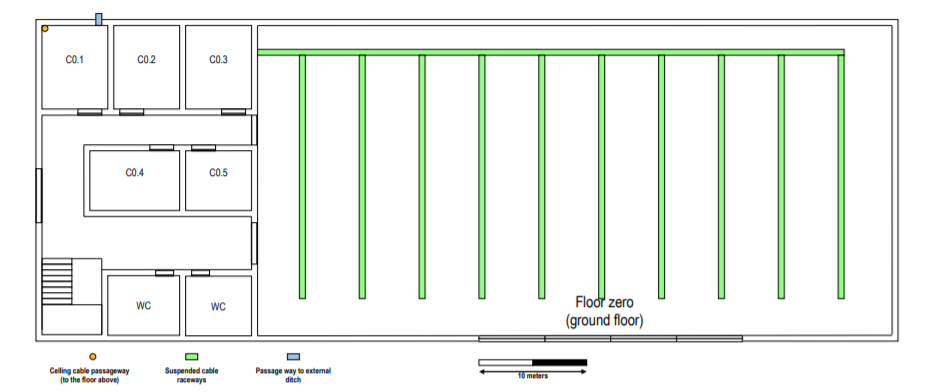
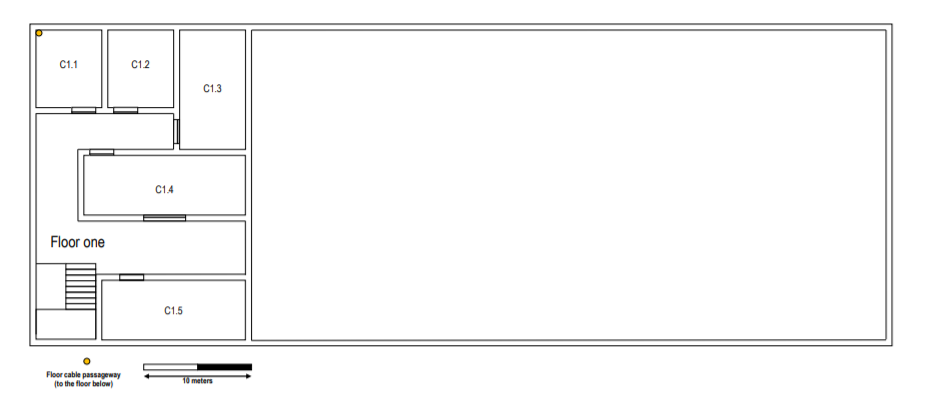

RCOMP 2019-2020 Project - Sprint 1 - Member 1180782 folder
===========================================
# Building C

Dimensions: Building C horizontal dimensions are, approximately, 80 x 30 meters (2400m²).

## Ground Floor

###### Room C0.1:
- Area: 43,17 m2.
- Number of outlets: 0.
- Cooper meters: 0.
- Equipment(s): 1 Intermediary Cross-Connect & 1 Horizontal Cross-Connect.

###### Room C0.2:
- Area: 43,17 m2.
- Number of outlets: 10.
- Copper meters: 62.
- Equipment(s): 1 Consolidation Point & 1 Switch 24 & 1 Patch Panel 24.

###### Room C0.3:
- Area: 43,17 m2.
- Number of outlets: 10.
- Copper meters: 62.
- Equipment(s): 1 Consolidation Point & 1 Switch 24 & 1 Patch Panel 24.

###### Room C0.4:
- Área: 41,84 m2.
- Number of outlets: 10.
- Cooper meters: 60.
- Equipment(s): 1 Consolidation Point & 1 Switch 24 & 1 Patch Panel 24.

###### Room C0.5:
- Área: 30,60 m2.
- Number of outlets: 8.
- Cooper meters: 44.
- Equipment(s): 1 Consolidation Point & 1 Switch 24 & 1 Patch Panel 24.

###### Open Area:
- Área: 1567,81 m2.
- Number of outlets: 316.
- Cooper meters: 8282.
- Equipment(s): 1 Horizontal Cross-Connect & 7 Consolidation Points & (5 Switch 48 & 2 Switch 72.) & 5 Patch Panel 48 & 2 Patch Panel 72.

## First Floor

###### Room C1.1:
- Area: 44,16 m2.
- Number of outlets: 0.
- Cooper meters: 0.
- Equipment(s): 1 Horizontal Cross-Connect.

###### Room C1.2:
- Area: 44,16 m2.
- Number of outlets: 10.
- Cooper meters: 61.
- Equipment(s): 1 Consolidation Point & 1 Switch 24 & 1 Patch Panel 24.

###### Room C1.3:
- Area: 69,37 m2.
- Number of outlets: 16.
- Cooper meters: 130.
- Equipment(s): 1 Consolidation Point & 1 Switch 24 & 1 Patch Panel 24.

###### Room C1.4:
- Area: 85,33 m2.
- Number of outlets: 20.
- Cooper meters: 210.
- Equipment(s): 1 Consolidation Point & 1 Switch 24 & 1 Patch Panel 24.

###### Room C1.5:
- Area: 75,18 m2.
- Number of outlets: 16.
- Cooper meters: 145.
- Equipment(s): 1 Consolidation Point & 1 Switch 24 & 1 Patch Panel 24.

## Inventory

###### Intermediary Cross-Connect (units):
- Ground Floor: 1.
- First Floor: 0.
- **Total**: 1.

###### Horizontal Cross-Connect (units):
- Ground Floor: 2.
- First Floor: 1.
- **Total**: 3.

###### Fiber Cable (meters):
- Ground Floor: 521.
- First Floor: 110.
- **Total**: 631.

###### Copper Cable - CAT6 (meters):
- Ground Floor: 8510.
- First Floor: 546.
- **Total**: 9056.

###### Consolidation Point (units):
- Ground Floor: 11.
- First Floor: 4.
- **Total**: 15.

###### Switch 24:
- Ground Floor: 4.
- First Floor: 4.
- **Total**: 8.

###### Switch 48:
- Ground Floor: 5.
- First Floor: 0.
- **Total:** 5.

###### Switch 72:
- Ground Floor: 2.
- First Floor: 0.
- **Total**: 2.

###### Patch Panel 24:
- Ground Floor: 4.
- First Floor: 4.
- **Total**: 8.

###### Patch Panel 48:
- Ground Floor: 5.
- First Floor: 0.
- **Total**: 5.

###### Patch Panel 72:
- Ground Floor: 2.
- First Floor: 0.
- **Total**: 2.

###### Patch Coords (units):
- Ground Floor: 354.
- First Floor: 62.
- **Total**: 416.

###### Outlet (units):
- Ground Floor: 354.
- First Floor: 62.
- **Total**: 416.

###### Wireless 802.11 Routers (units):
- Ground Floor: 2.
- First Floor: 1.
- **Total**: 3.

#### Notes:
- I considered that IC is located on the ground and HCs, CPs and outlets (except the ones that are not attached to a wall) are located 1,5 meters from the ground.
- In the open area, they (HCs, CPs and outlets) are located 3 meters from the ground.
- The meter values ​​shown are rounded and may contain small measurement errors.
